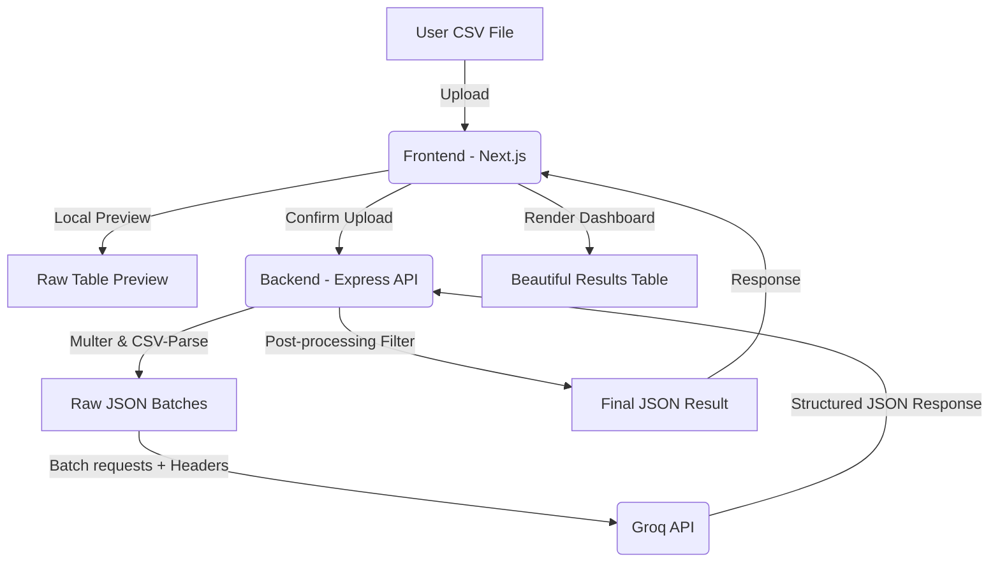

# GrowEasy AI-Powered CSV Lead Importer

An intelligent, responsive web application that extracts CRM lead information from any valid CSV layout using AI. It parses different structures (Facebook Lead Export, Google Ads, Excel sheets, Real Estate CRM exports) and maps them into the standardized GrowEasy CRM lead schema.

## Features

- **Drag & Drop CSV Upload:** Elegant glassmorphic area to upload CSV files with micro-animations.
- **Client-side Preview:** View the raw CSV columns and rows in a responsive scrollable table with sticky headers before any AI processing begins.
- **AI-Powered Mapping:** Sends records in batches to Groq (Llama 3.3 70B) to automatically extract lead fields, clean phone formats, split country codes, and map statuses/data sources.
- **Batched Incremental Processing:** Displays real-time progress indicators (e.g. "Analyzing batch 2 of 5...") preventing API timeouts.
- **Robust Retry & Backoff:** Client-side sequential batching retry mechanism with exponential backoff handles rate limits seamlessly.
- **Results Dashboard:** Displays metrics (Total Processed, Successfully Mapped, Skipped Rows, Success Rate).
- **Import Rules Enforcement:**
  - Standardizes CRM statuses to allowed values (`GOOD_LEAD_FOLLOW_UP`, `DID_NOT_CONNECT`, `BAD_LEAD`, `SALE_DONE`).
  - Standardizes Data Sources to allowed values (`leads_on_demand`, `meridian_tower`, `eden_park`, `varah_swamy`, `sarjapur_plots`).
  - Cleans dates to JavaScript-parseable strings.
  - Automatically skips records containing neither email nor mobile.
  - Extracts the first email/mobile and appends duplicate entries into consolidated notes.
- **Client-Side Export:** Download successfully mapped leads directly as clean JSON or CSV.
- **Dark Mode Support:** Smooth, premium glassmorphism visuals in both dark and light modes.

---

## Tech Stack

- **Frontend:** Next.js 15 (App Router, TypeScript) styled with custom Vanilla CSS.
- **Backend:** Node.js, Express, Multer, CSV-Parse.
- **AI Integration:** `groq-sdk` (Llama 3.3 70B Versatile model).

---

## Setup & Running Instructions

### Prerequisites
- Node.js (v20 or later)
- NPM
- A Groq API Key (get one at the [Groq Console](https://console.groq.com/))

### 1. Backend Setup
1. Open a terminal and navigate to the `backend` directory:
   ```bash
   cd backend
   ```
2. Install dependencies:
   ```bash
   npm install
   ```
3. Copy the `.env.example` file to `.env`:
   ```bash
   copy .env.example .env
   ```
4. Open the `.env` file and insert your API Key:
   ```env
   GROQ_API_KEY=your_actual_groq_api_key_here
   PORT=5000
   ```
   *(Note: The server also supports putting your Groq key into the `GEMINI_API_KEY` variable for backward compatibility).*
5. Start the backend development server:
   ```bash
   npm run dev
   ```
   The backend will run on `http://localhost:5000`.

### 2. Frontend Setup
1. Open a new terminal and navigate to the `frontend` directory:
   ```bash
   cd frontend
   ```
2. Install dependencies:
   ```bash
   npm install
   ```
3. Start the Next.js development server:
   ```bash
   npm run dev
   ```
   The frontend will run on `http://localhost:3000`.

---

## Test CSV Datasets

We have preloaded three test files in the `backend/test_files/` directory to help you evaluate the application:
1. `valid_leads.csv`: Standard CRM structure to verify normal processing.
2. `random_headers.csv`: A CSV with completely different headers ("Lead Name", "Primary E-mail", "Phone No", etc.) to evaluate AI header mapping capability.
3. `messy_leads.csv`: Contains edge cases such as:
   - Multiple emails (e.g. `rohan@gmail.com, rohan.work@gmail.com`).
   - Multiple phone numbers (e.g. `+1-555-0100, +1-555-0101`).
   - Row with neither email nor mobile (should be skipped).
   - Random project campaigns (should map to known ones or leave blank).
   - Unformatted dates and line breaks.

---

## Architecture Diagram


# Custom_CRM
